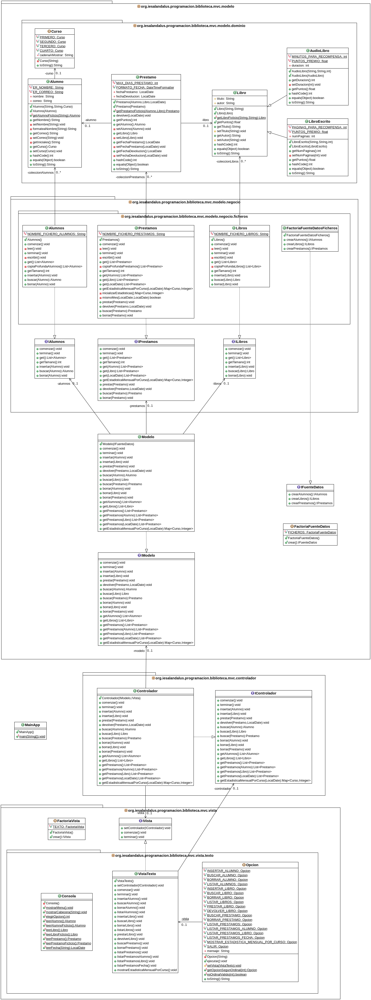

# Tarea: Biblioteca IES Al-Ándalus
## Profesor: José Ramón Jiménez Reyes
## Alumno:

Desde el IES Al-Ándalus nos acaban de comentar que por favor añadamos persistencia a los datos introducidos, ya que tal y como está ahora la aplicación no es funcional. Por tanto, en este **cuarto spring** añadiremos persistencia a los datos utilizando para ello ficheros de objetos, para lo que sustituiremos el modelo que teníamos de memoria, por un modelo de ficheros.

El diagrama de clases queda como te muestro a continuación y poco a poco te iré explicando los diferentes pasos a realizar:

En este repositorio de GitHub hay un esqueleto de proyecto gradle que ya lleva incluidos todos los test necesarios que el programa debe pasar.

Por tanto, tu tarea va a consistir en completar los siguientes apartados:

1. Lo primero que debes hacer es realizar un **fork** del repositorio donde he colocado el proyecto gradle con la estructura del proyecto y todos los test necesarios. Clona tu repositorio remoto recién copiado en github a un repositorio local que será donde irás realizando lo que a continuación se te pide. Añade tu nombre al fichero `README.md` en el apartado "Alumno". Copia los ficheros del directorio `src/main/java` de tu tarea anterior al repositorio local. Realiza tu primer commit.
2. Refactoriza para adecuar el proyecto al diagrama de clases. El paquete para las clases de negocio sea `ficheros`, la fuente de datos sea `FICHEROS`, etc.
3. Haz que las clases de dominio (para las que sea necesario) sean serializables para que se puedan leer y escribir de ficheros de objetos. Realiza un commit.
4. Implementa los métodos `comenzar` y `terminar` para la clase de negocio `Alumnos`. Añádelos también al interfaz correspondiente. El fichero de alumnos (al que debes referirte de forma relativa) se denominará `alumnos.dat` y estará situado en una carpeta denominada `datos` que se encontrará en la raíz del proyecto. Realiza un commit.
5. Implementa los métodos `comenzar` y `terminar` para la clase de negocio `Libros`. Añádelos también al interfaz correspondiente. El fichero de libros (al que debes referirte de forma relativa) se denominará `libros.dat` y estará situado en una carpeta denominada `datos` que se encontrará en la raíz del proyecto. Realiza un commit.
6. Implementa los métodos `comenzar` y `terminar` para la clase de negocio `Prestamos`. Añádelos también al interfaz correspondiente. El fichero de préstamos (al que debes referirte de forma relativa) se denominará `prestamos.dat` y estará situado en una carpeta denominada `datos` que se encontrará en la raíz del proyecto. Realiza un commit.
7. Modifica la clase `Modelo` y la interfaz `IModelo` para que contemple estos métodos y su implementación. Realiza un commit.
8. Haz las modificaciones oportunas en la clase `Controlador` para que al comenzar se lean los diferentes ficheros y al salir se escriban los mismos. Realiza un commit y súbelo a tu repositorio remoto.

###### Se valorará:
- La indentación debe ser correcta en todas las clases.
- El nombre de las variables debe ser adecuado.
- Se debe utilizar la clase `Entrada` para realizar la entrada por teclado.
- El proyecto debe pasar todas las pruebas que van en el esqueleto del mismo y toda entrada del programa será validada para evitar que el programa termine abruptamente debido a una excepción.
- Se deben utilizar los comentarios adecuados.
- Se valorará la corrección ortográfica tanto en los comentarios como en los mensajes que se muestren al usuario.

